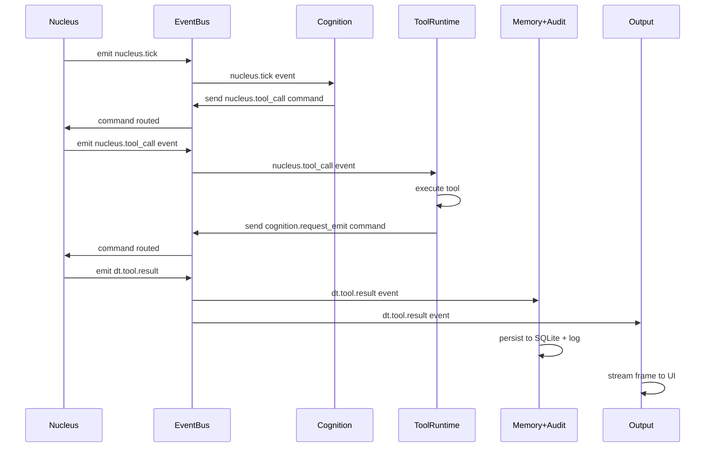

# Digital Twin Cortex: 2D Pre-Mortem Reconstruction

**BRAIN ARCHITECTURE**: Complete World Engine cognitive system for medical reconstruction, physiological simulation, and deterministic 2D visualization.

---

## Overview

The **Digital Twin Cortex** is a specialized World Engine BRAIN that *perceives medical data*, *builds connected body graphs*, *simulates physiological function*, and *renders 2D outputs* deterministically. This is not a one-off imaging pipeline—it's a complete cognitive architecture for anatomical reconstruction with full audit trails, invariant enforcement, and truth labeling.

**What Makes This a "Brain":**
- Sensory input normalization (RETINA)
- Visual recognition (V-CORTEX)
- Connectivity analysis (CONNECTOME)
- Autonomic regulation (BRAINSTEM)
- Motor control (CEREBELLUM/MOTOR)
- Visual output (OCCIPITAL)
- Memory + governance (HIPPOCAMPUS/PREFRONTAL)

---

## BRAIN Architecture: Layer-by-Layer

### 🧠 1. RETINA — Sensory Perception Layer

**Purpose**: Ingest raw medical imaging and normalize into engine-native canonical form.

**Modules**:
- **RETINA.Ingest** → Import DICOM series, volumetric datasets, anatomical landmarks
- **RETINA.Normalize** → Resample spacing, denoise, standardize orientation (RAS/LPS)
- **RETINA.QualityScan** → Detect motion artifacts, low contrast, incomplete coverage

**Outputs**:
```json
{
  "artifact": "case.volume",
  "metadata": {
    "spacing_mm": [0.5, 0.5, 1.0],
    "origin": [0, 0, 0],
    "direction": [[1,0,0], [0,1,0], [0,0,1]],
    "provenance_hash": "sha256:..."
  },
  "quality": {
    "contrast_snr": 12.3,
    "motion_detected": false,
    "confidence": 0.94
  }
}
```

**Invariants**:
- Same DICOM series → identical normalized volume hash
- Spacing/origin/direction recorded immutably
- Quality confidence ≥ 0.8 or explicit warning flag

**Architecture Mapping**: `Perception Layer → Normalizer`

---

### 🧠 2. V-CORTEX — Visual Recognition Layer

**Purpose**: Transform voxels into *named anatomy objects* (organs, vessels, bones, teeth, eyes).

**Modules**:
- **V1.EdgeFeature** → Compute vesselness filters, edge detection (Frangi, Hessian)
- **V2.Segment** → Multi-class segmentation (arteries, veins, organs, bone, dental, ocular)
- **V4.LabelFusion** → Merge multi-pass segmentations, resolve label conflicts

**Outputs**:
```json
{
  "artifact": "labels.anatomy",
  "label_map": {
    "1": "aorta",
    "2": "carotid_left",
    "3": "carotid_right",
    "100": "heart_lv",
    "200": "skull",
    "300": "dental_arch"
  },
  "confidence": {
    "aorta": 0.97,
    "carotid_left": 0.89
  },
  "provenance": {
    "model": "medseg_v3.2",
    "parameters": {"threshold": 0.5}
  }
}
```

**Invariants**:
- Label IDs stable across runs (same anatomy → same label ID)
- Every label has provenance (model version + parameters)
- Confidence scores recorded for all structures

**Architecture Mapping**: `Perception Layer → Recognition (V-CORTEX segmentation)`

---

### 🧠 3. CONNECTOME — Topology & Connectivity Layer

**Purpose**: Convert anatomy into **connected graphs** (vascular tree, neural pathways, musculoskeletal chains).

**Modules**:
- **CONNECTOME.Centerlines** → Extract vessel/nerve/tract centerlines from label volumes
- **CONNECTOME.GraphBuild** → Construct node-edge graphs (branch points, radii, directions)
- **CONNECTOME.Validate** → Check connectivity, detect dangling branches, broken topology

**Outputs**:
```json
{
  "artifact": "vascular.graph",
  "nodes": [
    {"id": "n0", "pos": [50, 60, 70], "type": "junction"},
    {"id": "n1", "pos": [52, 62, 72], "type": "branch"}
  ],
  "edges": [
    {
      "id": "e0",
      "endpoints": ["n0", "n1"],
      "length_mm": 5.3,
      "radius_mm": 2.1,
      "direction": "proximal_to_distal"
    }
  ],
  "connectivity": {
    "components": 1,
    "inlets": ["aortic_root"],
    "outlets": ["vena_cava_inf"]
  }
}
```

**Invariants**:
- Graph connectivity explicitly validated (`components == 1` OR whitelisted disconnects)
- No edge with missing endpoints
- Radii within plausible bounds for image resolution (0.1mm - 50mm)
- All inlets/outlets labeled

**Architecture Mapping**: `Cognition Module → Topology Planner`

---

### 🧠 4. BRAINSTEM — Autonomic Physiology Layer

**Purpose**: Produce **functional runtime behavior** (flow, pressure, pulsation) that drives 2D visuals.

**Modules**:
- **BRAINSTEM.CardiacClock** → Heart cycle timing (systole/diastole phases, 60-180 bpm)
- **BRAINSTEM.Hemodynamics** → 0D/1D flow/pressure solver over vascular graph
- **BRAINSTEM.Compliance** → Vessel radius changes vs pressure (pulsation realism)
- **BRAINSTEM.Pathways** → General physiological routing (neural, lymphatic)

**Outputs**:
```json
{
  "artifact": "sim.state",
  "time_ms": 1234,
  "cardiac_phase": "systole",
  "hemodynamics": {
    "flow": {"e0": 5.2, "e1": 2.8},
    "pressure": {"n0": 120, "n1": 118},
    "radius": {"e0": 2.15, "e1": 1.82}
  },
  "perfusion": {"heart_lv": 0.94, "brain": 0.89}
}
```

**Invariants**:
- No NaN/Inf values in simulation state
- Pressure bounded (0-300 mmHg configurable)
- Flow conservation at junctions (tolerance ±5%)
- Deterministic stepping (fixed dt + RNG seed)

**Architecture Mapping**: `Tool Runtime → Physics Solvers`

---

### 🧠 5. MOTOR — Biomechanics & Motion Layer

**Purpose**: Controlled motion systems (skeleton, eyes, dental articulation).

**Modules**:
- **CEREBELLUM.MotionIntegrator** → Smooth trajectory integration (no jitter/overshoot)
- **MOTOR.Kinesiology** → Skeleton/joints/muscle actuators (simplified rigid-body)
- **MOTOR.Ocular** → Gaze control + extraocular muscle torque model (6 muscles × 2 eyes)
- **MOTOR.DentalArch** → Dental arch curve + occlusion mapping + 2D projection

**Outputs**:
```json
{
  "artifact": "pose.state",
  "time_ms": 1234,
  "skeleton": {
    "elbow_flexion_deg": 45,
    "knee_extension_deg": 10
  },
  "eyes": {
    "gaze_azimuth_deg": 5,
    "gaze_elevation_deg": -2,
    "pupil_diameter_mm": 3.5
  },
  "dental": {
    "arch_curve": "parabolic",
    "occlusion_class": "class_i"
  }
}
```

**Invariants**:
- Joint angles within anatomical limits (ROM constraints)
- Stable integration (bounded velocities/accelerations)
- Gaze vector unit-normalized
- Dental occlusion constraints enforced

**Architecture Mapping**: `Tool Runtime → Biomechanics Solvers`

---

### 🧠 6. OCCIPITAL — 2D Rendering Cortex

**Purpose**: Produce final deliverable: **2D digital reconstruction with functional overlays**.

**Modules**:
- **OCCIPITAL.MPR** → Multi-planar reformats (axial/coronal/sagittal slices)
- **OCCIPITAL.MIP** → Maximum intensity projection (excellent for vessels)
- **OCCIPITAL.OverlayComposer** → Layer labels + flow arrows + heatmaps + strain maps
- **OCCIPITAL.Timeline** → Frame sequencing + export bundles

**Outputs**:
```json
{
  "artifact": "render.frame",
  "frame_id": 42,
  "time_ms": 1234,
  "format": "png",
  "dimensions": [1920, 1080],
  "camera": {
    "type": "mpr_axial",
    "slice_z_mm": 120
  },
  "overlays": ["vessels", "flow_arrows", "pressure_heatmap"],
  "hash": "sha256:..."
}
```

**Invariants**:
- Same sim state + same camera → identical frame hash (deterministic rendering)
- Every frame includes: `case_id`, `sim_time`, `camera_id`, `hash`
- Frame hashes form chain (frame[n] includes hash[n-1])

**Architecture Mapping**: `Output Layer → Visualization Stream`

---

### 🧠 7. HIPPOCAMPUS/PREFRONTAL — Memory & Governance

**Purpose**: Make this a *World Engine brain* with versioning, scenarios, and invariant enforcement.

**Modules**:
- **HIPPOCAMPUS.CaseMemory** → Store case snapshots (immutable versions)
- **PREFRONTAL.ScenarioControl** → Execute "what-if" scenarios (exercise, occlusion, gaze shift)
- **IMMUNE.InvariantsRegistry** → Health lights (🟢🟡🔴) + reject bad states
- **AUDIT.EventImprint** → Deterministic event log + SQLite imprint store

**Outputs**:
```json
{
  "artifact": "case.snapshot",
  "snapshot_id": "snap_001",
  "timestamp": "2026-02-22T10:30:00Z",
  "artifacts": [
    "case.volume@sha256:...",
    "labels.anatomy@sha256:...",
    "vascular.graph@sha256:..."
  ],
  "chain_head": "sha256:..."
}
```

**Invariants**:
- Every artifact traceable to event chain
- Snapshots immutable (restore + diff)
- Invariant failures block progression

**Architecture Mapping**: `Memory + Audit Subsystem`

---

## Core Capabilities (Deliverables)

### ✅ Intricate Vascular Systems

**What Users Get**:
- MIP vascular maps (maximum intensity projection)
- Centerline overlays showing branching topology
- Flow direction arrows
- Pressure + perfusion heatmaps
- Pulsation visualization (radius changes over cardiac cycle)

**BRAIN Mapping**: RETINA → V-CORTEX → CONNECTOME → BRAINSTEM → OCCIPITAL

**Truth Labels**:
- **Measured**: Vessel centerlines from imaging data
- **Inferred**: Flow rates from 1D solver
- **Synthesized**: Capillary bed density (template-based)

---

### ✅ Real Physiological Simulation

**What Users Get**:
- Cardiac cycle timeline (heart rate, phase durations)
- Waveform-driven vessel pulsation
- Pressure-volume loops
- Optional respiration coupling (diaphragm motion → intrathoracic pressure)

**BRAIN Mapping**: BRAINSTEM.CardiacClock → BRAINSTEM.Hemodynamics → BRAINSTEM.Compliance

**Truth Labels**:
- **Measured**: Cardiac output from imaging (if available)
- **Inferred**: Pressure distribution from boundary conditions
- **Synthesized**: Compliance curves (literature-based)

---

### ✅ Comprehensive Physiology Integration

**Cardiac Motions**:
- Myocardial contraction cycles (systole, diastole)
- Valve dynamics (mitral, tricuspid, aortic, pulmonary)
- Electrical conduction overlays (SA node → AV node → Purkinje)
- Hemodynamic coupling (Starling curves, preload/afterload)

**Kinesiology**:
- Joint articulation visualization (ROM envelopes)
- Muscle activation overlays (agonist/antagonist pairs)
- Skeletal motion constraints (collision detection)
- Force propagation vectors through kinematic chains

**Ocular Motions**:
- Saccadic eye movements (rapid target acquisition)
- Smooth pursuit tracking trajectories
- Vergence control (binocular convergence/divergence)
- Pupillary reflex (light response, accommodation)

**Neural Pathways**:
- Cranial nerve trajectories (12 pairs, 2D projection)
- Spinal cord tracts (ascending/descending pathways)
- Peripheral nerve distributions (dermatome/myotome maps)
- Autonomic chains (sympathetic/parasympathetic routing)

**Dental Arch**:
- Tooth morphology (crown/root anatomy)
- Occlusion dynamics (centric relation, excursive movements)
- Periodontal ligament mechanics
- TMJ articulation (panoramic projection)

**BRAIN Mapping**: MOTOR.Kinesiology + MOTOR.Ocular + MOTOR.DentalArch → OCCIPITAL.OverlayComposer

---

### ✅ Deterministic Export

**What Users Get**:
- `case.bundle.zip` (hashable artifact pack)
- Includes: volume, labels, graphs, sim states, render frames, audit chain
- Restore from snapshot → reproduce exact outputs
- Diff tool for comparing snapshots

**BRAIN Mapping**: HIPPOCAMPUS.CaseMemory + AUDIT.EventImprint

---

## System Integration: Nucleus + EventBus Wiring

### Brain Diagram (Flow)

```
┌─────────────────────────────────────────────────────────────┐
│                     DIGITAL TWIN CORTEX                      │
└─────────────────────────────────────────────────────────────┘

[DICOM/Volume Data]
         ↓
    ╔═══════════════╗
    ║ RETINA        ║  ← Perception Layer
    ║ ·Ingest       ║
    ║ ·Normalize    ║
    ║ ·QualityScan  ║
    ╚═══════════════╝
         ↓
    ╔═══════════════╗
    ║ V-CORTEX      ║  ← Recognition Layer
    ║ ·EdgeFeature  ║
    ║ ·Segment      ║
    ║ ·LabelFusion  ║
    ╚═══════════════╝
         ↓
    ╔═══════════════╗
    ║ CONNECTOME    ║  ← Topology Layer
    ║ ·Centerlines  ║
    ║ ·GraphBuild   ║
    ║ ·Validate     ║
    ╚═══════════════╝
         ↓
    ╔═══════════════╗
    ║ BRAINSTEM     ║  ← Autonomic Layer
    ║ ·Cardiac      ║
    ║ ·Hemodynamics ║
    ║ ·Compliance   ║
    ╚═══════════════╝
         ↓
    ╔═══════════════╗
    ║ MOTOR         ║  ← Biomechanics Layer
    ║ ·Kinesiology  ║
    ║ ·Ocular       ║
    ║ ·DentalArch   ║
    ╚═══════════════╝
         ↓
    ╔═══════════════╗
    ║ OCCIPITAL     ║  ← Output Layer
    ║ ·MPR          ║
    ║ ·MIP          ║
    ║ ·Overlay      ║
    ║ ·Timeline     ║
    ╚═══════════════╝
         ↓
    ╔═══════════════════════════════════╗
    ║ HIPPOCAMPUS + PREFRONTAL + AUDIT  ║  ← Memory + Governance
    ║ ·CaseMemory  ·ScenarioControl     ║
    ║ ·InvariantsRegistry  ·EventImprint║
    ╚═══════════════════════════════════╝
         ↓
   [2D Reconstruction Export]
```

---

### Commands (Nucleus → EventBus)

Commands are **requests with ACK/NACK responses** that drive the pipeline forward.

```python
# Phase 1: Ingest
digital_twin.ingest(
    case_id: str,
    dicom_series_path: str,
    landmarks: Optional[dict]
) → case.volume + metadata

# Phase 2: Segment
digital_twin.segment(
    case_id: str,
    volume_hash: str,
    target_labels: list[str]
) → labels.anatomy

# Phase 3: Build Topology
digital_twin.build_connectome(
    case_id: str,
    labels_hash: str,
    system: str  # "vascular" | "neural" | "skeletal"
) → vascular.graph

# Phase 4: Simulate
digital_twin.simulate(
    case_id: str,
    graph_hash: str,
    duration_ms: int,
    heart_rate_bpm: int
) → sim.states[]

# Phase 5: Render
digital_twin.render2d(
    case_id: str,
    sim_state_hash: str,
    camera_config: dict,
    overlays: list[str]
) → render.frames[]

# Phase 6: Export
digital_twin.export(
    case_id: str,
    snapshot_id: str,
    format: str  # "bundle" | "video" | "images"
) → case.bundle.zip
```

**Command Envelope Example**:
```json
{
  "command_id": "cmd_segment_001",
  "command_type": "digital_twin.segment",
  "trace_id": "trace_case_001",
  "required_acks": ["dt_worker_segmenter"],
  "timeout_ms": 120000,
  "payload": {
    "case_id": "case_001",
    "volume_hash": "sha256:...",
    "target_labels": ["aorta", "carotid_left", "carotid_right"]
  }
}
```

---

### Events (EventBus → Subscribers)

Events are **broadcast notifications** that announce state changes (no ACK required).

```python
# Progress Events
dt.case.ingested(case_id, volume_hash, quality)
dt.segmentation.completed(case_id, labels_hash, stats)
dt.connectome.completed(case_id, graph_hash, connectivity)
dt.sim.tick(case_id, time_ms, cardiac_phase, hemodynamics)
dt.sim.completed(case_id, sim_hash, duration_ms)
dt.render.frame_completed(case_id, frame_id, frame_hash)
dt.export.completed(case_id, bundle_hash, artifacts)

# Health Events
dt.health.passed(case_id, invariant_group, details)
dt.health.warning(case_id, invariant_name, details)
dt.health.failed(case_id, invariant_name, details)  # BLOCKS PROGRESSION

# Scenario Events
dt.scenario.started(case_id, scenario_type, parameters)
dt.scenario.completed(case_id, scenario_hash, results)
```

**Event Envelope Example**:
```json
{
  "event_type": "dt.connectome.completed",
  "event_id": "evt_1234567890",
  "trace_id": "trace_case_001",
  "seq": 1842,
  "ts_ms": 1709454600000,
  "payload": {
    "case_id": "case_001",
    "artifact": "vascular.graph",
    "hash": "sha256:abcd...",
    "stats": {
      "nodes": 1284,
      "edges": 1402,
      "components": 1,
      "total_length_mm": 3245.7
    },
    "warnings": []
  }
}
```

---

### Data Flow (Sequence Diagram)

```
User → Nucleus → EventBus → Subscribers → Memory

1. User: "Reconstruct case_001"
2. Nucleus.call_tool("digital_twin.ingest", {...})
3. EventBus.send_command("digital_twin.ingest")
4. DTWorker.ingest() → normalizes volume
5. EventBus.emit_event("dt.case.ingested")
6. DeterministicEventLog.append(event)
7. SQLiteImprintStore.mirror_event(event)
8. Nucleus.call_tool("digital_twin.segment", {...})
9. DTWorker.segment() → produces labels
10. EventBus.emit_event("dt.segmentation.completed")
11. ... (repeat for connectome, sim, render, export)
12. Nucleus → User: "Export complete: case.bundle.zip@sha256:..."
```

---

## Invariants Registry (Health Lights 🟢🟡🔴)

The **Invariants Registry** is the Digital Twin Cortex's **immune system**. If invariants fail, the system **refuses to pretend it worked** and emits `dt.health.failed` events.

### Connectivity Invariants

```python
invariant_connectivity_components:
  rule: vascular.graph.components == 1 OR in disconnected_whitelist
  severity: ERROR
  action: BLOCK_PROGRESSION

invariant_edge_endpoints:
  rule: all edges have valid node references
  severity: ERROR
  action: BLOCK_PROGRESSION

invariant_radii_bounds:
  rule: 0.1mm <= radius <= 50mm (configurable per vessel type)
  severity: WARNING
  action: LOG_WARNING

invariant_inlets_outlets:
  rule: graph has labeled inlets AND outlets
  severity: ERROR
  action: BLOCK_PROGRESSION
```

### Simulation Invariants

```python
invariant_no_nan_inf:
  rule: no NaN/Inf in {flow, pressure, radius}
  severity: ERROR
  action: ROLLBACK_TIMESTEP

invariant_pressure_bounds:
  rule: 0 <= pressure <= 300 mmHg (configurable)
  severity: ERROR
  action: ROLLBACK_TIMESTEP

invariant_flow_conservation:
  rule: Σ flow_in == Σ flow_out at junctions (tolerance ±5%)
  severity: WARNING
  action: LOG_WARNING

invariant_deterministic_step:
  rule: same state + same dt + same seed → same next_state
  severity: ERROR
  action: HALT_SIMULATION
```

### Render Invariants

```python
invariant_deterministic_render:
  rule: same sim_state + same camera → identical frame_hash
  severity: ERROR
  action: REJECT_FRAME

invariant_frame_metadata:
  rule: all frames include {case_id, sim_time, camera_id, hash}
  severity: ERROR
  action: REJECT_FRAME

invariant_hash_chain:
  rule: frame[n].prev_hash == frame[n-1].hash
  severity: ERROR
  action: REJECT_TIMELINE
```

### Audit Invariants

```python
invariant_artifact_traceability:
  rule: every artifact has event chain reference
  severity: ERROR
  action: REJECT_ARTIFACT

invariant_snapshot_immutability:
  rule: snapshot_id → immutable artifact set
  severity: ERROR
  action: REJECT_SNAPSHOT

invariant_event_chain_integrity:
  rule: hash_chain_next(prev, event) == current_hash
  severity: ERROR
  action: HALT_SYSTEM
```

**Health Light Legend**:
- 🟢 **PASSED**: All invariants satisfied
- 🟡 **WARNING**: Non-critical invariant violated (logged but continues)
- 🔴 **FAILED**: Critical invariant violated (blocks progression, emits `dt.health.failed`)

---

## Truth Label System 🏷️

Because this reconstructs **"pre-mortem form"**, every output carries a **scientific honesty label**:

### Label Types

**🔵 MEASURED** (directly from imaging):
- Vessel centerlines extracted from CT angiography
- Organ boundaries from MRI segmentation
- Bone density from DICOM Hounsfield units
- Actual cardiac output if available

**🟠 INFERRED** (estimated from models):
- Flow rates from 1D hemodynamic solver
- Pressure distribution from boundary conditions
- Vessel compliance curves from literature
- Muscle activation timing from kinematic constraints

**🟣 SYNTHESIZED** (template-based fill-ins):
- Capillary bed density (resolution-limited)
- Neural pathway routing (atlas-based)
- Dental occlusion (class I/II/III templates)
- Extraocular muscle insertion points (anatomical averages)

### Label Enforcement

**Every artifact includes truth metadata**:
```json
{
  "artifact": "vascular.graph",
  "hash": "sha256:...",
  "truth_labels": {
    "centerlines": "MEASURED",
    "radii": "MEASURED",
    "flow_rates": "INFERRED",
    "capillary_density": "SYNTHESIZED"
  },
  "confidence": {
    "centerlines": 0.97,
    "radii": 0.89,
    "flow_rates": 0.72,
    "capillary_density": 0.45
  }
}
```

**Rendering includes truth overlays**:
- Measured regions: solid colors
- Inferred regions: hatched patterns
- Synthesized regions: dashed outlines + transparency

**This is how your engine stays *scientifically honest* while being visually elite.**

---

## World Engine BRAIN: Runtime Binding

This section bridges the conceptual architecture above with the **actual Nucleus/EventBus/ToolRuntime implementation**. This is how the Digital Twin Cortex "snaps into" World Engine primitives.

---

### The Living Brain Loop (Sequence)

Your existing runtime enforces these **hard constraints**:

1. **Only Nucleus may emit events** (`EventBus.emit_event_nucleus_only` guards it)
2. Everyone else must **request Nucleus to emit** via `cognition.request_emit` command
3. Tools are requested via `nucleus.tool_call` command → Nucleus emits `nucleus.tool_call` event
4. **ToolRuntime subscribes to events**, executes tools, sends `cognition.request_emit` for results

**Real Runtime Sequence**:

```
1. Nucleus emits nucleus.tick event (every tick_interval_s)
2. Cognition (planner) decides actions for this tick:
   - Call physiology.sim.step
   - Call render.vascular_tree (every Nth tick)
   - Call export (on demand)
3. Cognition issues nucleus.tool_call commands
4. Nucleus emits nucleus.tool_call events (one per tool request)
5. ToolRuntime executes the tool (serial queue)
6. ToolRuntime sends cognition.request_emit command
7. Nucleus emits dt.tool.result and/or physiology.simulation.tick
8. Memory/Audit subscribers persist; Output subscribers stream
```

**This is the brainstem wiring that makes everything connect cleanly.**

---

### BRAIN Sequence Diagram (Runtime)



---

### ID Standardization (Correlation)

To maintain determinism and debuggability, **every tool call + result must share**:

| Field | Purpose | Example |
|-------|---------|---------|
| `trace_id` | End-to-end tracing (already in envelopes) | `"trace_case_001"` |
| `call_id` | Correlate request → result | `"call_000042"` |
| `case_id` | Identify which patient/dataset | `"case_001"` |
| `sim_time_ms` | Simulation clock (for physics outputs) | `1234` |
| `frame_id` | Render frame identifier | `"frame_1234"` |

**Rule**: ToolRuntime **never invents meanings**—it only returns results correlated to the request.

---

### Canonical Contracts

#### Command: nucleus.tool_call

**Sent by**: Cognition or Nucleus.call_tool()  
**Handled by**: Nucleus (emits event)

```json
{
  "command_type": "nucleus.tool_call",
  "payload": {
    "tool": "physiology.sim.step",
    "args": {
      "case_id": "case_001",
      "call_id": "call_000042",
      "dt_ms": 16,
      "sim_time_ms": 1234,
      "systems": ["vascular", "cardiac"],
      "state_ref": "sha256:..."
    }
  }
}
```

#### Command: cognition.request_emit

**Sent by**: ToolRuntime, Cognition  
**Handled by**: Nucleus (emits event on behalf)

```json
{
  "command_type": "cognition.request_emit",
  "payload": {
    "priority": "normal",
    "event_type": "dt.tool.result",
    "event_payload": {
      "case_id": "case_001",
      "call_id": "call_000042",
      "tool": "physiology.sim.step",
      "ok": true,
      "duration_ms": 6,
      "result": {
        "sim_time_ms": 1250,
        "cardiac_phase": "systole",
        "vessel_pressures": {"aorta": 120, "vena_cava": 5}
      }
    }
  }
}
```

#### Event: dt.tool.result

**Emitted by**: Nucleus (on ToolRuntime request)  
**Consumed by**: Memory, Output, Cognition

```json
{
  "event_type": "dt.tool.result",
  "seq": 1842,
  "trace_id": "trace_case_001",
  "payload": {
    "case_id": "case_001",
    "call_id": "call_000042",
    "tool": "physiology.sim.step",
    "ok": true,
    "duration_ms": 6,
    "result": {
      "sim_time_ms": 1250,
      "cardiac_phase": "systole",
      "vessel_pressures": {"aorta": 120, "vena_cava": 5}
    }
  }
}
```

#### Event: physiology.simulation.tick

**Emitted by**: Nucleus (on ToolRuntime request)  
**Consumed by**: Domain-specific subscribers (telemetry, UI)

```json
{
  "event_type": "physiology.simulation.tick",
  "seq": 1843,
  "trace_id": "trace_case_001",
  "payload": {
    "case_id": "case_001",
    "sim_time_ms": 1250,
    "cardiac_phase": "systole",
    "hemodynamics": {
      "flow": {"aorta": 5.2, "carotid_left": 1.8},
      "pressure": {"aortic_root": 120, "left_ventricle": 118},
      "radius": {"aorta": 12.5, "carotid_left": 4.2}
    }
  }
}
```

#### Event: render.frame.completed

**Emitted by**: Nucleus (on render tool request)  
**Consumed by**: Output layer (UI streaming)

```json
{
  "event_type": "render.frame.completed",
  "seq": 1844,
  "trace_id": "trace_case_001",
  "payload": {
    "case_id": "case_001",
    "frame_id": "frame_1250",
    "sim_time_ms": 1250,
    "hash": "sha256:abcd...",
    "prev_hash": "sha256:1234...",
    "viewport": {"x": 0, "y": 0, "width": 1920, "height": 1080},
    "overlays": ["vessels", "flow_arrows", "pressure_heatmap"]
  }
}
```

---

### ToolRuntime Implementation (Production-Clean)

**File**: `unified_nexus/tool_runtime/dt_runtime.py`

```python
"""
BRAIN ARCHITECTURE: Tool Runtime (Enhanced for Digital Twin)
Executes physiology simulation + rendering tools with proper correlation.
"""

from __future__ import annotations

import asyncio
import time
from dataclasses import dataclass
from typing import Any, Awaitable, Callable, Dict, Optional

from ..contracts_v1_schema import make_v1_command
from ..contracts_v1_types import V1EventEnvelope
from ..event_bus import EventBus

COGNITION_EMIT_COMMAND = "cognition.request_emit"
TOOL_CALL_EVENT_TYPE = "nucleus.tool_call"

ToolFn = Callable[[Dict[str, Any]], Awaitable[Dict[str, Any]]]


@dataclass(frozen=True)
class ToolResult:
    ok: bool
    result: Dict[str, Any]
    error: str = ""


class ToolRegistry:
    """Registry of executable tools (physiology sim, rendering, export)."""

    def __init__(self) -> None:
        self._tools: Dict[str, ToolFn] = {}

    def register(self, name: str, fn: ToolFn) -> None:
        if not name or not callable(fn):
            raise ValueError("Invalid tool registration")
        if name in self._tools:
            raise ValueError(f"Tool already registered: {name}")
        self._tools[name] = fn

    def get(self, name: str) -> Optional[ToolFn]:
        return self._tools.get(name)


class DTToolRuntime:
    """
    Digital Twin ToolRuntime: listens for nucleus.tool_call EVENTS,
    executes tools, requests Nucleus to emit results via cognition.request_emit.
    
    Respects EventBus constraint: only Nucleus may emit events.
    """

    def __init__(self, bus: EventBus, registry: ToolRegistry) -> None:
        self.bus = bus
        self.registry = registry
        self.bus.subscribe_event(TOOL_CALL_EVENT_TYPE, self._on_tool_call_event)

    async def _on_tool_call_event(self, evt: V1EventEnvelope) -> None:
        """Handle nucleus.tool_call event: execute tool → request result emit."""
        payload = dict(evt.payload or {})
        tool = str(payload.get("tool", ""))
        args = dict(payload.get("args", {}))
        command_id = str(payload.get("command_id", ""))
        trace_id = evt.trace_id

        t0 = time.time()
        out = await self._execute_tool(tool, args)
        dur_ms = int((time.time() - t0) * 1000)

        # Build dt.tool.result event payload (domain-neutral)
        case_id = str(args.get("case_id", ""))
        call_id = str(args.get("call_id", command_id or ""))
        event_payload = {
            "case_id": case_id,
            "call_id": call_id,
            "tool": tool,
            "ok": out.ok,
            "duration_ms": dur_ms,
            "result": out.result if out.ok else {},
            "error": out.error if not out.ok else "",
        }

        # Ask Nucleus to emit result event (ONLY nucleus may emit)
        cmd = make_v1_command(
            command_type=COGNITION_EMIT_COMMAND,
            ts_ms=int(time.time() * 1000),
            trace_id=trace_id,
            payload={
                "priority": "normal",
                "event_type": "dt.tool.result",
                "event_payload": event_payload,
            },
        )
        await self.bus.send_command(cmd)

    async def _execute_tool(self, tool: str, args: Dict[str, Any]) -> ToolResult:
        """Execute tool function with error handling."""
        fn = self.registry.get(tool)
        if fn is None:
            return ToolResult(ok=False, result={}, error=f"Unknown tool: {tool}")
        try:
            result = await fn(args)
            if not isinstance(result, dict):
                return ToolResult(ok=False, result={}, error="Tool returned non-dict")
            return ToolResult(ok=True, result=result)
        except Exception as exc:
            return ToolResult(ok=False, result={}, error=f"{type(exc).__name__}: {exc}")
```

---

### Example Tools (Minimal but Correct)

**File**: `unified_nexus/tools/physiology_sim.py`

```python
"""
BRAIN ARCHITECTURE: Tool Runtime → Physiology Simulation
Implements deterministic hemodynamic solver (simplified 0D model).
"""

from typing import Any, Dict


async def physiology_sim_step(args: Dict[str, Any]) -> Dict[str, Any]:
    """
    Advance simulation by dt_ms.
    
    Args:
        sim_time_ms: Current simulation time
        dt_ms: Time step (16ms = 60Hz)
        systems: List of active systems ["vascular", "cardiac"]
        state_ref: Hash of previous state (for determinism checks)
    
    Returns:
        {
            "sim_time_ms": new_time,
            "cardiac_phase": "systole" | "diastole",
            "vessel_pressures": {vessel_id: pressure_mmHg}
        }
    """
    sim_time_ms = int(args.get("sim_time_ms", 0))
    dt_ms = int(args.get("dt_ms", 16))

    # Advance time
    t = sim_time_ms + dt_ms

    # Simple cardiac cycle (400ms period = 150 bpm)
    # Replace with real solver: 1D finite volume method on vascular graph
    cycle_ms = 400
    phase = "systole" if (t % cycle_ms) < 200 else "diastole"

    # Example pressure values (replace with graph-based hemodynamics)
    pressures = {
        "aorta": 120 if phase == "systole" else 80,
        "carotid_left": 118 if phase == "systole" else 78,
        "vena_cava": 5
    }

    return {
        "sim_time_ms": t,
        "cardiac_phase": phase,
        "vessel_pressures": pressures,
    }
```

**File**: `unified_nexus/tools/render_2d.py`

```python
"""
BRAIN ARCHITECTURE: Tool Runtime → 2D Rendering (OCCIPITAL)
Generates deterministic 2D frames from simulation state.
"""

import hashlib
import json
from typing import Any, Dict


async def render_vascular_tree(args: Dict[str, Any]) -> Dict[str, Any]:
    """
    Render 2D vascular tree visualization.
    
    Args:
        case_id: Patient/dataset identifier
        sim_time_ms: Simulation time for this frame
        viewport: {x, y, width, height}
        vessel_ids: List of vessels to render
        overlays: List of overlay types ["flow_arrows", "pressure_heatmap"]
    
    Returns:
        {
            "frame_id": unique identifier,
            "hash": deterministic frame hash,
            "prev_hash": previous frame hash (chain),
            "viewport": viewport config,
            "vessel_ids": rendered vessels
        }
    """
    viewport = dict(args.get("viewport", {"x": 0, "y": 0, "width": 1920, "height": 1080}))
    vessel_ids = list(args.get("vessel_ids", []))
    sim_time_ms = int(args.get("sim_time_ms", 0))
    overlays = list(args.get("overlays", []))

    # Deterministic hash: same inputs → same hash
    blob = json.dumps({
        "viewport": viewport,
        "vessel_ids": vessel_ids,
        "sim_time_ms": sim_time_ms,
        "overlays": overlays
    }, sort_keys=True).encode("utf-8")
    frame_hash = hashlib.sha256(blob).hexdigest()

    # In real implementation:
    # - Load vascular graph from SQLite
    # - Apply 2D projection (MPR or MIP)
    # - Composite overlays (flow arrows, pressure heatmap)
    # - Write PNG/SVG to ./runtime/frames/{case_id}/frame_{sim_time_ms}.png
    # - Return storage path + hash

    return {
        "frame_id": f"frame_{sim_time_ms}",
        "hash": f"sha256:{frame_hash}",
        "prev_hash": args.get("prev_hash", ""),
        "viewport": viewport,
        "vessel_ids": vessel_ids,
        "overlays": overlays,
    }
```

---

### Tool Registration

**File**: `unified_nexus/tool_runtime/register_dt_tools.py`

```python
"""Register all Digital Twin tools."""

from .dt_runtime import ToolRegistry
from ..tools.physiology_sim import physiology_sim_step
from ..tools.render_2d import render_vascular_tree


def build_dt_registry() -> ToolRegistry:
    """Build registry with all DT tools."""
    reg = ToolRegistry()
    reg.register("physiology.sim.step", physiology_sim_step)
    reg.register("render.vascular_tree", render_vascular_tree)
    # Future: register("dt.ingest", ...), register("dt.segment", ...)
    return reg
```

---

### Cognition Tick Policy (Planner)

**Cognition subscribes to `nucleus.tick` and decides actions**:

```python
async def on_nucleus_tick(evt: V1EventEnvelope) -> None:
    """
    Cognition planner: decide which tools to call this tick.
    
    Policy:
    - Every tick: advance simulation by dt_ms
    - Every Nth tick: render frame (30-60 fps target)
    - On demand: export bundle
    """
    tick_count = evt.payload.get("tick_count", 0)
    
    # Always advance simulation
    await nucleus.call_tool("physiology.sim.step", {
        "case_id": "case_001",
        "call_id": f"call_{tick_count:06d}",
        "sim_time_ms": tick_count * 16,
        "dt_ms": 16,
        "systems": ["vascular", "cardiac"]
    })
    
    # Render every 2 ticks (30 fps at 60 Hz tick)
    if tick_count % 2 == 0:
        await nucleus.call_tool("render.vascular_tree", {
            "case_id": "case_001",
            "call_id": f"call_render_{tick_count:06d}",
            "sim_time_ms": tick_count * 16,
            "viewport": {"x": 0, "y": 0, "width": 1920, "height": 1080},
            "vessel_ids": ["aorta", "carotid_left", "carotid_right"],
            "overlays": ["flow_arrows", "pressure_heatmap"]
        })
```

---

### Invariant Registry (Immune System)

**File**: `unified_nexus/dt_invariants.py`

```python
"""
BRAIN ARCHITECTURE: Prefrontal Cortex → Invariant Registry (Immune System)
Validates outputs and emits dt.health.failed on violations.
"""

from typing import Any, Dict
from ..contracts_v1_types import V1EventEnvelope
from ..event_bus import EventBus


class InvariantRegistry:
    """Health checks for Digital Twin outputs."""

    def __init__(self, bus: EventBus) -> None:
        self.bus = bus
        self.bus.subscribe_event("dt.tool.result", self._check_invariants)

    async def _check_invariants(self, evt: V1EventEnvelope) -> None:
        """Check tool results for invariant violations."""
        payload = evt.payload or {}
        tool = payload.get("tool", "")
        ok = payload.get("ok", False)
        result = payload.get("result", {})

        if not ok:
            return  # Tool already failed, no need to check

        # Check tool-specific invariants
        if tool == "physiology.sim.step":
            await self._check_sim_invariants(evt, result)
        elif tool == "render.vascular_tree":
            await self._check_render_invariants(evt, result)

    async def _check_sim_invariants(self, evt: V1EventEnvelope, result: Dict[str, Any]) -> None:
        """Validate simulation outputs."""
        pressures = result.get("vessel_pressures", {})
        
        # Invariant: no NaN/Inf
        for vessel, pressure in pressures.items():
            if not isinstance(pressure, (int, float)):
                await self._emit_health_failed(evt, f"Non-numeric pressure for {vessel}")
                return
            if pressure < 0 or pressure > 300:
                await self._emit_health_warning(evt, f"Pressure out of range: {vessel}={pressure}")

    async def _check_render_invariants(self, evt: V1EventEnvelope, result: Dict[str, Any]) -> None:
        """Validate render outputs."""
        frame_hash = result.get("hash", "")
        frame_id = result.get("frame_id", "")
        
        # Invariant: must have hash and frame_id
        if not frame_hash:
            await self._emit_health_failed(evt, "Render missing hash")
        if not frame_id:
            await self._emit_health_failed(evt, "Render missing frame_id")

    async def _emit_health_failed(self, evt: V1EventEnvelope, reason: str) -> None:
        """Emit critical health failure (blocks progression)."""
        from ..contracts_v1_schema import make_v1_command
        import time
        
        cmd = make_v1_command(
            command_type="cognition.request_emit",
            ts_ms=int(time.time() * 1000),
            trace_id=evt.trace_id,
            payload={
                "priority": "high",
                "event_type": "dt.health.failed",
                "event_payload": {
                    "invariant": "output_validation",
                    "reason": reason,
                    "seq": evt.seq
                }
            }
        )
        await self.bus.send_command(cmd)

    async def _emit_health_warning(self, evt: V1EventEnvelope, reason: str) -> None:
        """Emit non-critical health warning (logged but continues)."""
        # Similar to failed, but event_type = "dt.health.warning"
        pass
```

---

### BRAIN Region Mapping (Implementation)

| Conceptual Region | Runtime Component | File Location |
|-------------------|-------------------|---------------|
| RETINA (Perception) | DICOM ingest tools | `unified_nexus/tools/dicom_ingest.py` |
| V-CORTEX (Segmentation) | Segmentation tools | `unified_nexus/tools/segmentation.py` |
| CONNECTOME (Topology) | Graph builder tools | `unified_nexus/tools/graph_builder.py` |
| BRAINSTEM (Simulation) | Physiology sim tools | `unified_nexus/tools/physiology_sim.py` |
| MOTOR (Biomechanics) | Motion solver tools | `unified_nexus/tools/biomechanics.py` |
| OCCIPITAL (Rendering) | 2D renderer tools | `unified_nexus/tools/render_2d.py` |
| HIPPOCAMPUS (Memory) | SQLiteImprintStore | `unified_nexus/storage/sqlite_imprints.py` |
| PREFRONTAL (Control) | Cognition planner | `unified_nexus/cognition/dt_planner.py` |
| IMMUNE (Invariants) | InvariantRegistry | `unified_nexus/dt_invariants.py` |

---

## Performance Targets

**Simulation**:
- Tick rate: 60 Hz (16.67 ms/tick)
- Hemodynamic solver: <10 ms/tick (1000+ edges)
- Biomechanics solver: <5 ms/tick (100+ DOF)
- Memory footprint: <4 GB for full-body vascular model

**Rendering**:
- Frame rate: 30-60 fps
- MPR slice generation: <16 ms/frame
- MIP projection: <50 ms/frame (adaptive quality)
- Overlay compositing: <10 ms/frame

**Export**:
- Bundle generation: <30 seconds per case
- Snapshot restore: <10 seconds
- Diff computation: <5 seconds

**Startup**:
- Cold boot: <5 seconds (runtime initialization)
- Case load: <15 seconds (volume + graphs + sim state)

---

## Implementation Checklist

**Phase 1: Runtime Binding** (Priority: 🔥 CRITICAL)
- [ ] DTToolRuntime class (enhanced with correlation IDs)
- [ ] ToolRegistry + registration pattern
- [ ] InvariantRegistry (immune system)
- [ ] Cognition planner (tick policy subscriber)
- [ ] Event/command contracts (standardized payloads)

**Phase 2: Core Tools** (Priority: HIGH)
- [ ] physiology.sim.step (0D/1D hemodynamic solver)
- [ ] render.vascular_tree (MPR/MIP 2D renderer)
- [ ] dt.export (bundle generator with snapshots)

**Phase 3: Perception** (RETINA + V-CORTEX)
- [ ] DICOM ingestion (pydicom + simpleitk)
- [ ] Volume normalization (resampling, orientation)
- [ ] Quality scan (SNR, motion detection)
- [ ] Multi-organ segmentation (nnU-Net or equivalent)
- [ ] Label fusion + conflict resolution

**Phase 4: Topology** (CONNECTOME)
- [ ] Centerline extraction (skeletonization algorithms)
- [ ] Graph construction (branch detection, radius estimation)
- [ ] Connectivity validation (components, inlets/outlets)
- [ ] Graph serialization (JSON + provenance)

**Phase 5: Advanced Simulation** (BRAINSTEM + MOTOR)
- [ ] Cardiac clock (phase timing, heart rate control)
- [ ] 1D hemodynamic solver (finite volume method)
- [ ] Compliance curves (pressure-radius relationships)
- [ ] Biomechanics integrator (rigid body dynamics)
- [ ] Ocular motion controller (saccades, smooth pursuit)

**Phase 6: Rendering** (OCCIPITAL)
- [ ] MPR slicer (arbitrary plane extraction)
- [ ] MIP projector (maximum intensity along rays)
- [ ] Overlay composer (blend modes, alpha compositing)
- [ ] Timeline sequencer (frame ordering + export)
- [ ] Truth label overlays (MEASURED/INFERRED/SYNTHESIZED visual encoding)

**Phase 7: Memory + Governance** (HIPPOCAMPUS + AUDIT)
- [ ] Case snapshot manager (immutable versions)
- [ ] Scenario executor (parameter sweeps)
- [ ] Invariants checker (rule engine)
- [ ] Event log integration (chain head tracking)
- [ ] Health light dashboard (🟢🟡🔴 status UI)

**Phase 8: Integration Testing**
- [ ] Command/event schema validation (contracts_v1_schema)
- [ ] Nucleus job registration (tick loops)
- [ ] ToolRuntime determinism tests (same input → same output)
- [ ] Frame hash chain validation
- [ ] Snapshot restore + diff verification

---

## Future Enhancements

### 3D Extension
- Stereoscopic 3D rendering (depth perception)
- VR/AR support (immersive anatomy)
- Volumetric ray tracing (global illumination)

### Interactive Control
- Real-time parameter adjustment (heart rate, blood pressure, joint angles)
- Scenario branching (compare baseline vs pathology)
- User-driven camera control (pan/zoom/rotate)

### AI-Driven Reconstruction
- Neural network segmentation (nnU-Net, TransUNet)
- Topology inference from partial data (graph completion)
- Super-resolution (enhance low-quality scans)

### Multiplayer Simulation
- Synchronize multiple client viewports via EventBus
- Collaborative annotation (shared labels/landmarks)
- Distributed rendering (split workload across nodes)

### Clinical Validation
- Ground-truth comparison with real patient data
- Statistical shape models (population averages)
- Pathology detection (anomaly scoring)

---

## Quick Start

**1. Ingest a case:**
```bash
pnpm run nucleus -- digital_twin.ingest \
  --case-id case_001 \
  --dicom-path ./data/case_001/series_001 \
  --landmarks ./data/case_001/landmarks.json
```

**2. Run full pipeline:**
```bash
pnpm run nucleus -- digital_twin.reconstruct \
  --case-id case_001 \
  --target-systems vascular,skeletal \
  --render-format bundle
```

**3. Export results:**
```bash
# Creates ./runtime/exports/case_001.bundle.zip
pnpm run nucleus -- digital_twin.export \
  --case-id case_001 \
  --format bundle
```

---

## Technical Requirements

**Core Dependencies**:
- Python 3.10+ (simulation + segmentation)
- Node.js 18+ (UI + rendering pipeline)
- SQLite 3.35+ (event store)
- WebGL 2.0 (browser rendering)

**Python Packages**:
- `simpleitk` (medical image I/O)
- `pydicom` (DICOM parsing)
- `scipy` (numerical solvers)
- `networkx` (graph algorithms)
- `pillow` (image export)

**Optional Dependencies**:
- `nnU-Net` or `TotalSegmentator` (ML segmentation)
- `vmtk` (vascular modeling toolkit)
- `opencv` (image processing)

**Hardware Targets**:
- CPU: 8+ cores (parallel segmentation)
- RAM: 16 GB+ (full-body volumes)
- GPU: Optional (accelerated rendering/ML)

**Performance Targets**:
- Simulation tick rate: 60 Hz
- Rendering frame rate: 30-60 fps
- Memory footprint: <4 GB for full-body vascular model
- Startup time: <5 seconds from cold boot

---

## See Also

- [BRAIN_CHAT_ARCHITECTURE.md](./BRAIN_CHAT_ARCHITECTURE.md) - Core World Engine architecture
- [ARCHITECTURE_QUICK_REFERENCE_DIAGRAMS.md](./ARCHITECTURE_QUICK_REFERENCE_DIAGRAMS.md) - System diagrams
- [AUTONOMY_INTEGRATION_COMPLETE.md](./AUTONOMY_INTEGRATION_COMPLETE.md) - Autonomous pipeline integration
- [AGENT_SYSTEM_QUICKSTART.md](./AGENT_SYSTEM_QUICKSTART.md) - Getting started with agents

**Related Modules**:
- `unified_nexus/nucleus/nucleus.py` - Orchestration layer
- `unified_nexus/event_bus.py` - Event/command bus
- `unified_nexus/tool_runtime.py` - Tool execution
- `unified_nexus/logging/deterministic_event_log.py` - Audit trail
- `unified_nexus/storage/sqlite_imprints.py` - Event storage

---

*Last Updated: February 22, 2026*
*Digital Twin Cortex v1.0 - World Engine BRAIN Specialization*
