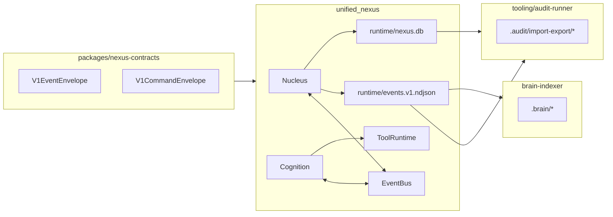

# System Spine Integration Checklist

This checklist is the wiring-first plan to keep one runtime spine:

- `unified_nexus` is the only global sequencer and logged event emitter.
- `runtime/events.v1.ndjson` and `runtime/nexus.db` are canonical runtime artifacts.
- `.audit/import-export/*` and `.brain/*` are deterministic derivations.
- `apps/*` connect through tools + commands/events, not direct app-to-app calls.

## Canonical Paths

- `runtime/events.v1.ndjson` — deterministic event log (hash chained)
- `runtime/nexus.db` — runtime db mirror
- `.audit/import-export/*` — audit outputs
- `.brain/*` — brain indexes
- `pipeline_results/*` — generated pipeline artifacts

## Phase A — Spine Foundation

- [ ] Create `packages/nexus-contracts` as shared contract surface.
- [ ] Move/alias v1 event+command envelope constants there.
- [ ] Keep nucleus-only event emission.
- [ ] Keep deterministic event log + sqlite mirror + backpressure.

## Phase B — Audit Subscriber

- [x] Added `tooling/audit-runner/index.mjs` (reads runtime log/db and writes `.audit/import-export/*`).
- [ ] Expand offender checks for missing ACK lineage and tool-call SLA thresholds.
- [ ] Wire CI to fail on blocking offenders.

## Phase C — Brain Indexer

- [ ] Add `apps/brain-indexer` (preferred source: `runtime/events.v1.ndjson`).
- [ ] Generate `.brain/knowledge.ndjson` and `.brain/review.queue.ndjson` deterministically.
- [ ] Expose `brain.query` tool to nexus runtime.

## Phase D — Tool Adapters

- [ ] Wrap `apps/py-sidecar` endpoints as tool runtime adapters.
- [ ] Wrap autonomy-loop planner as adapter tool.
- [ ] Wrap chat routing as adapter tool.

## Phase E — Command Center

- [ ] Implement `apps/command-center` to observe and control spine.
- [ ] Tail event log read-only.
- [ ] Trigger `spine audit` and show offenders.

## Spine CLI Commands

Implemented in `tools/spine.mjs`:

- `pnpm spine:up`
- `pnpm spine:audit`
- `pnpm spine:replay -- --log runtime/events.v1.ndjson`
- `pnpm spine:doctor`

## Dependency Diagram

## Lock-The-Spine Acceptance Criteria

- [ ] Only Nucleus emits logged events.
- [ ] Event seq is strictly increasing.
- [ ] Hash-chain verification passes.
- [ ] Audit outputs are deterministic for same inputs.
- [ ] Brain outputs are deterministic for same inputs.
- [ ] Apps interact via tools or contracts, not app-to-app direct calls.
